# Kickoff Launcher for the COSMIC™ desktop

A KDE Kickoff-style application menu applet for the [COSMIC™ desktop](https://github.com/pop-os/cosmic-epoch), built with [libcosmic](https://github.com/pop-os/libcosmic).

Based on the [COSMIC Applet Template](https://github.com/pop-os/cosmic-applet-template).

## Features

- Grid, list and hybrid layouts (the hybrid layout uses grids for Favourites and Recents)
- Configurable menu size presets and custom dimensions
- Favourites and recent applications
- Pin apps to the COSMIC dock
- Bottom bar with pinned apps and power actions
- Panel icons in COSMIC, System76, KDE, Xfce, Haiku, Debian and other styles, with monochrome options
- Optional standalone window mode (`--window`)

## Layouts

Choose how apps are shown. Hybrid uses the grid for Favourites and Recents, and the list for the other categories.

<table>
  <tr>
    <td>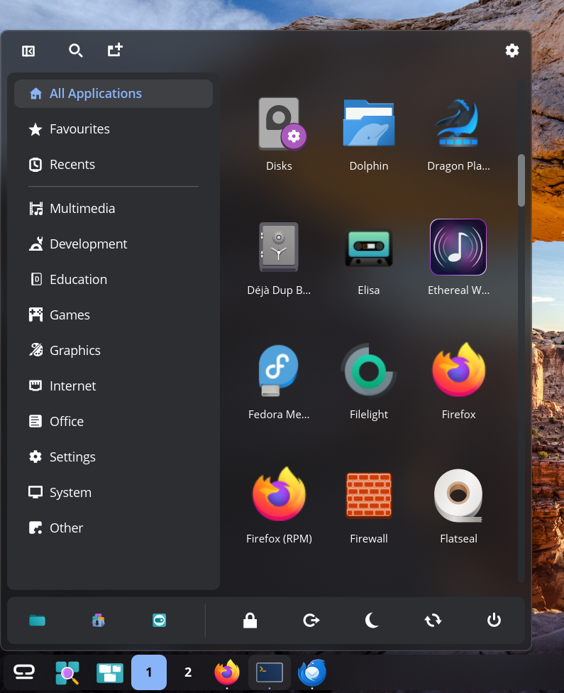<br><strong>Grid</strong><br>Browse apps by their icons.</td>
    <td>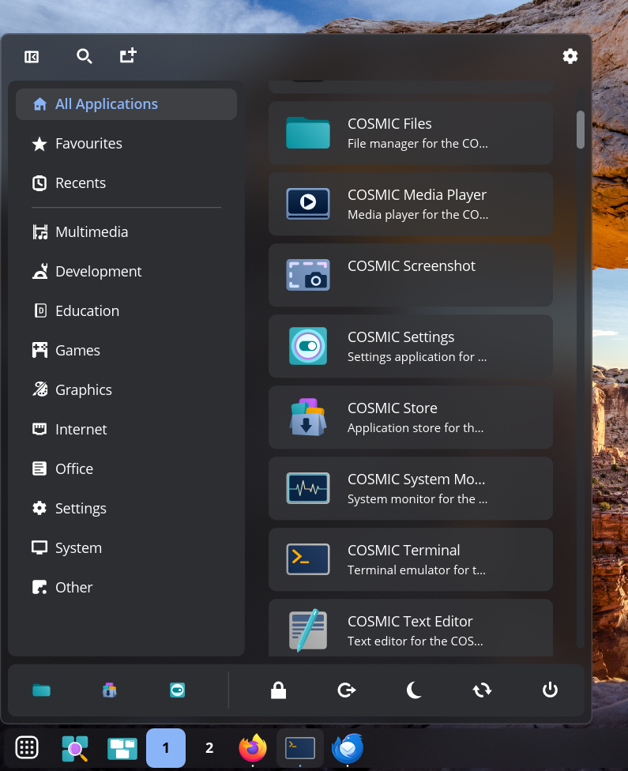<br><strong>List</strong><br>See app names and descriptions in rows.</td>
    <td>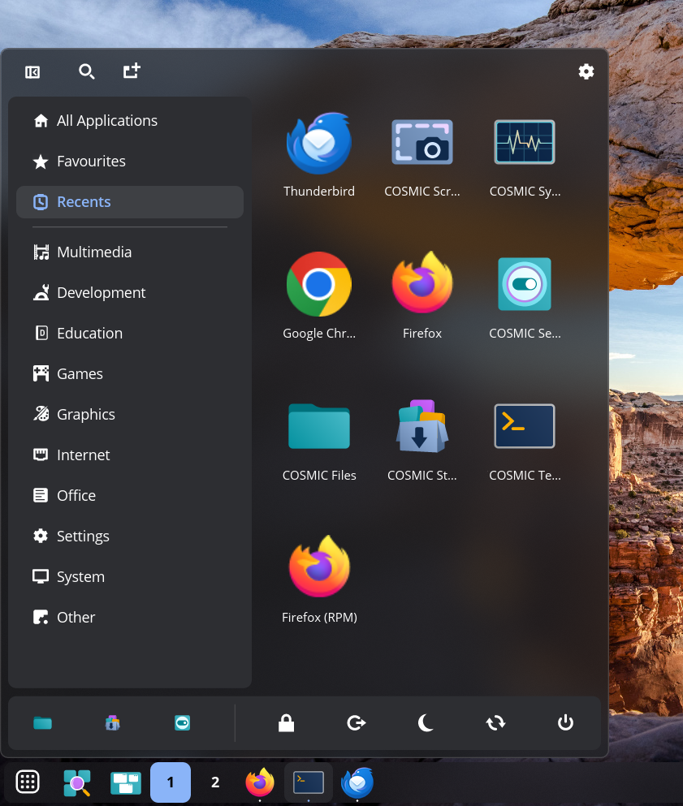<br><strong>Hybrid</strong><br>Favourites and Recents use the grid; other categories use the list.</td>
  </tr>
</table>

## Screenshots

<table>
  <tr>
    <td><br><strong>Recent apps</strong><br>Apps you have opened recently appear here.</td>
    <td>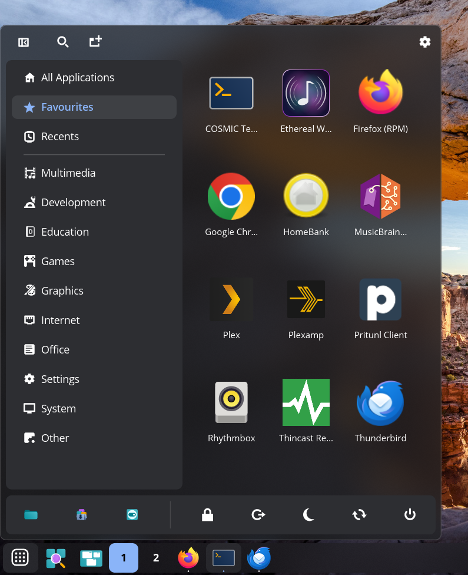<br><strong>Favourites</strong><br>Your favourite apps in a grid, with the category list alongside.</td>
  </tr>
  <tr>
    <td><br><strong>List view</strong><br>Apps appear with their names and descriptions.</td>
    <td>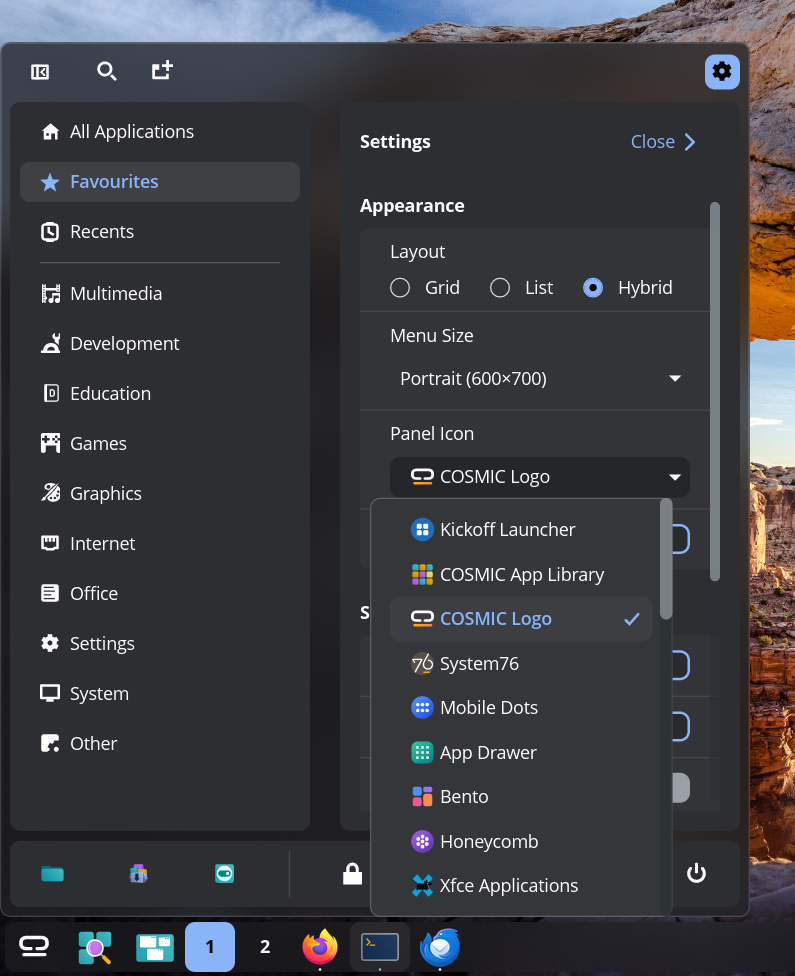<br><strong>Appearance settings</strong><br>Set the layout and menu size, and choose a panel icon.</td>
  </tr>
  <tr>
    <td><br><strong>All applications</strong><br>Browse installed apps by category.</td>
    <td>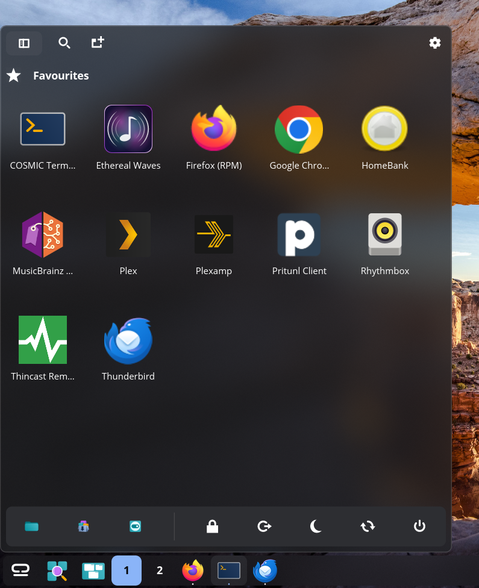<br><strong>Collapsed sidebar</strong><br>Collapse the sidebar to make more room for apps.</td>
  </tr>
  <tr>
    <td>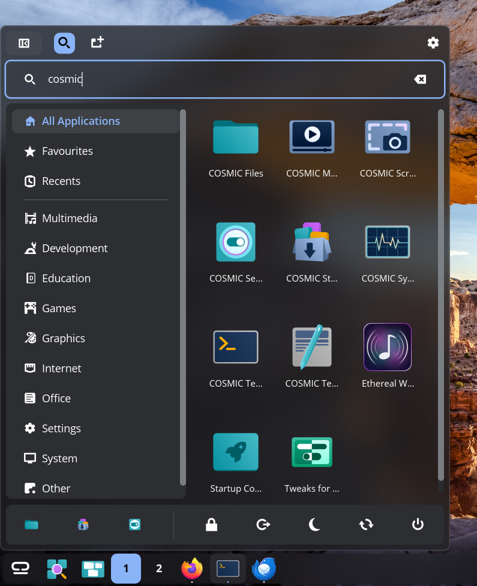<br><strong>Search</strong><br>Type to narrow the list of apps.</td>
    <td>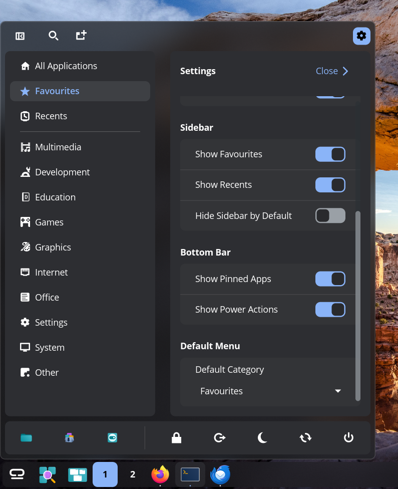<br><strong>Sidebar and bottom bar</strong><br>Choose which sections and controls to show.</td>
  </tr>
  <tr>
    <td><br><strong>Bottom bar without pinned apps</strong><br>Hide pinned apps while keeping the power controls.</td>
    <td>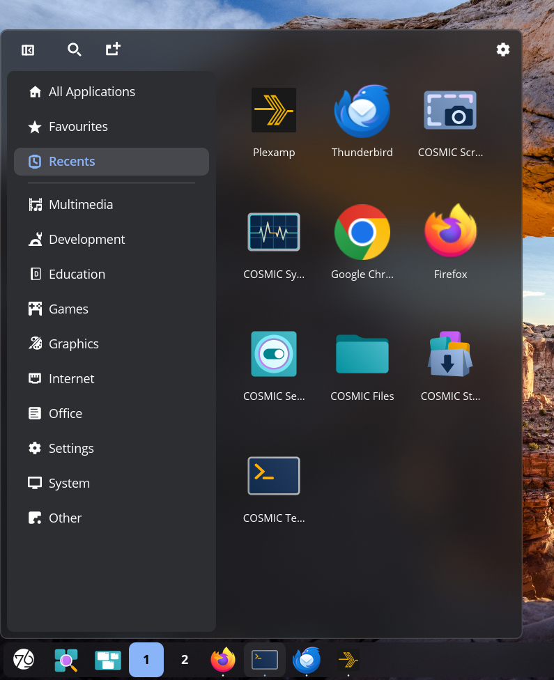<br><strong>Bottom bar hidden</strong><br>Turn off both options to remove the bar.</td>
  </tr>
  <tr>
    <td>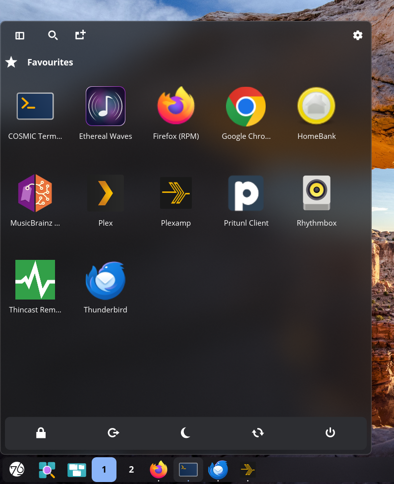<br><strong>Compact favourites view</strong><br>Favourites opens by default, with the sidebar and pinned apps hidden. Power controls remain in the bottom bar.</td>
    <td>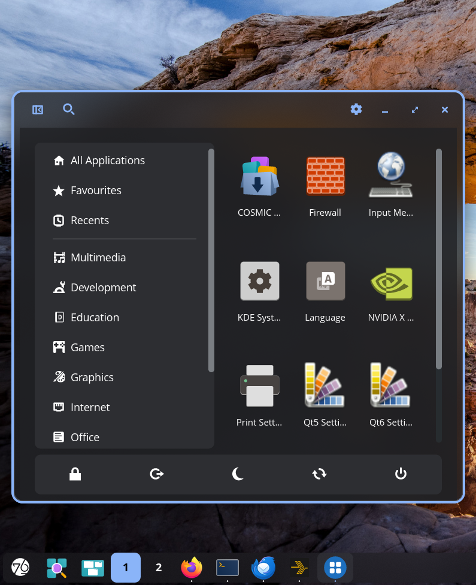<br><strong>Standalone window</strong><br>The launcher can also run in its own desktop window.</td>
  </tr>
</table>

## Settings

Settings are grouped into Appearance, Sidebar, Bottom Bar and Default Menu.

<table>
  <tr>
    <td><br><strong>Appearance</strong></td>
    <td><br><strong>Sidebar, bottom bar, and default menu</strong></td>
  </tr>
</table>

### Appearance

- **Layout:** Grid shows app icons in a grid. List shows app names and descriptions. Hybrid uses grids for Favourites and Recents, and a list for other categories.
- **Menu Size:** Choose Small, Medium, Medium Square, Large, Tall, Square, Portrait or Custom. Custom lets you enter the width and height.
- **Panel Icon:** Choose the icon for the panel button. Options include the launcher and COSMIC icons, plus icons from other menu styles.
- **Monochrome icon:** Use the symbolic version of the selected icon when one is available.

### Sidebar

- **Show Favourites** and **Show Recents:** Show or hide these sections in the sidebar.
- **Hide Sidebar by Default:** Start with the sidebar collapsed. You can still open it from the launcher.

### Bottom Bar

- **Show Pinned Apps:** Show your pinned apps in the bottom bar.
- **Show Power Actions:** Show session controls for locking, logging out, suspending, restarting or shutting down. Turn off both options to hide the bottom bar.

### Default Menu

- **Default Category:** Choose what opens with the launcher: All Applications, a populated Favourites or Recents list, or any installed app category.

## Building

```
just              # build-release
just run          # build and run
just install-user # install for the current user (no root required)
just install      # install system-wide (requires sudo)
just run-window   # build and run the menu in a standalone window
just check        # clippy with pedantic warnings
```

## Licence

Licensed under the [GPL-3.0-only](LICENSE).

See [Third-party notices](THIRD_PARTY_NOTICES.md) for icon-theme and trademark
information, exact artwork sources, revisions, attributions, and licences.
